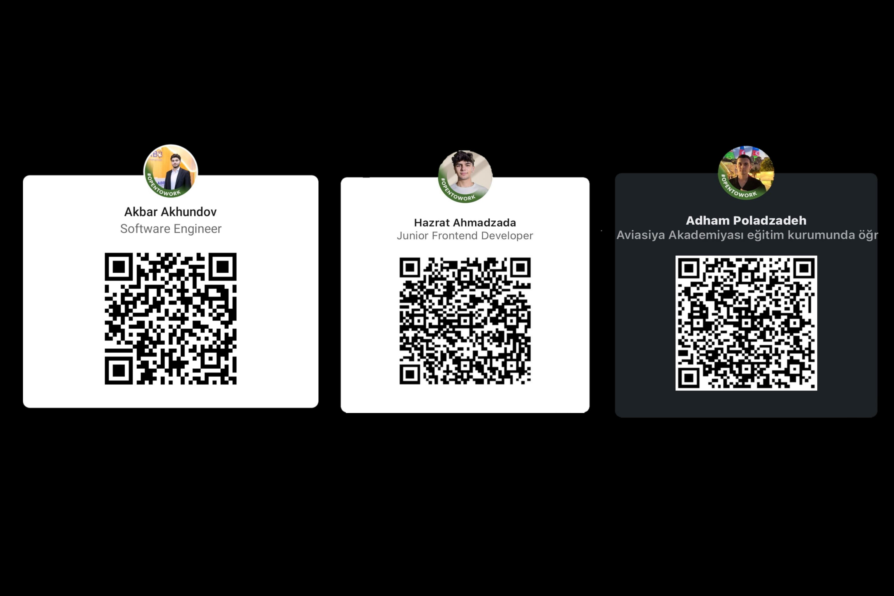

# Israel Azerbaijan Training Center - Chicago Bulls

 Welcome to the Chicago Bulls Site, your go-to destination for comprehensive information about the iconic Chicago Bulls basketball team. This project serves as the final submission for the Israel Azerbaijan Training Center. Our team, consisting of Akbar Akhundov, Hazrat Ahmadzada, and Adham Poladzada, has collaborated to create a dynamic and engaging web platform that caters to both Bulls enthusiasts and those seeking in-depth insights into the team's world. The project incorporates elements from a Figma design, while certain aspects have been crafted with our unique perspective and implementation.

## Table of contents

- [Overview](#overview)
  - [Figma file](#figma-file)
  - [The challenge](#the-challenge)
  - [Screenshot](#screenshot)
  - [Links](#links)
- [Process](#process)
  - [Built with](#built-with)
  - [Useful resources](#useful-resources)
- [Authors](#authors)
- [Linkedin QR Codes](#linkedin-qr-codes)

## Figma file
[Chicago Bulls Figma file](https://www.figma.com/file/cBN5lNRXfpZKQynB92eXzR/Chicago-Bulls-Basketball?type=design&node-id=0%3A1&mode=design&t=Zgdr8ljQEDLSVnae-1).

### The challenge

Users should be able to:

- View the optimal layout for the site depending on their device's screen size
- See hover states for all interactive elements on the page
- Register, Login and Log out
- Add items to cart
- Filter and Sort products

### Screenshot

## Process

### Built with
  - VITE
  - REACT
  - TYPESCRIPT
  - CSS3
  - NODEJS
  - EXPRESS JS
  - POSTGRESQL

### Note for Better UnderStanding

This project is a Chicago Bulls website developed using Vite for the frontend and Node.js with PostgreSQL for the backend. The frontend is built with React, TypeScript, and CSS to provide a dynamic and responsive user interface.

### Frontend Technologies

- **React:** The project leverages React for building the user interface, allowing for efficient component-based development.
  
- **TypeScript:** TypeScript is used to bring static typing to the project, enhancing code quality and providing better developer tooling.

- **CSS:** Cascading Style Sheets are utilized for styling the frontend, ensuring a visually appealing and consistent design throughout the application.

### Backend Technologies

- **Node.js:** The backend is powered by Node.js, providing a scalable and non-blocking server environment for handling requests and managing the application's logic.

- **PostgreSQL:** PostgreSQL is employed as the relational database management system, storing data related to team information, games, products, tickets, and user accounts.

### Project Features

The Chicago Bulls site encompasses the following features:

- **Team Information:** Users can access detailed information about the Chicago Bulls team, including player profiles, statistics, and more.

- **Games:** The website provides up-to-date information about games, including schedules, scores, and game-related details.

- **Products:** Users can explore and purchase Chicago Bulls merchandise and products.

- **Tickets:** Information about upcoming games and the ability to purchase tickets are available through the site.

- **User Authentication:** Users can register, log in, and log out, allowing for personalized experiences and access to additional features.

### How to Run the Project

To run the project locally, follow these steps:

1. Clone the repository.
2. Navigate to the project directory.
3. Install dependencies using `npm install` in both the `client` and `server` directories.
4. Start the frontend and backend servers using `npm run dev` in their respective directories.

Feel free to explore the codebase, and don't hesitate to reach out if you have any questions or encounter issues.

### Useful resources

### Vite (Frontend Build Tool)
- [Vite Documentation](https://vitejs.dev/guide/): Official documentation for Vite, the frontend build tool used in this project.

### React (JavaScript Library for UI)
- [React Documentation](https://reactjs.org/docs/getting-started.html): Official documentation for React, the JavaScript library used for building user interfaces.

### TypeScript (Typed Superset of JavaScript)
- [TypeScript Documentation](https://www.typescriptlang.org/docs/): Official documentation for TypeScript, the statically typed superset of JavaScript used in this project.

### Node.js (JavaScript Runtime for Backend)
- [Node.js Documentation](https://nodejs.org/en/docs/): Official documentation for Node.js, the JavaScript runtime used for building the backend of your project.

### PostgreSQL (Relational Database)
- [PostgreSQL Documentation](https://www.postgresql.org/docs/): Official documentation for PostgreSQL, the open-source relational database management system used in this project.

### General Web Development Resources
- [MDN Web Docs](https://developer.mozilla.org/en-US/docs/Web): Mozilla Developer Network provides comprehensive web development documentation and guides.

### React and TypeScript Tutorials
- [React + TypeScript Cheatsheets](https://github.com/typescript-cheatsheets/react): A collection of cheatsheets to help you with React and TypeScript development.

### Node.js and Express Tutorials
- [Node.js + Express.js Guide](https://developer.mozilla.org/en-US/docs/Learn/Server-side/Express_Nodejs): Learn how to use Node.js and Express.js to build web applications.

### Database Design and SQL
- [Database Design Tutorial](https://www.tutorialspoint.com/dbms/index.htm): Tutorial on database design concepts and principles.
- [W3Schools SQL Tutorial](https://www.w3schools.com/sql/): Comprehensive SQL tutorial by W3Schools.

Feel free to explore these resources for in-depth information and tutorials on the technologies used in your project.

## Authors

- [Akbar Akhundov](https://www.linkedin.com/in/akbar-akhundov-93697524b/)
- [Hazrat Ahmadzada](https://www.linkedin.com/in/hazrat-ahmadzada-927b24252/)
- [Adham Poladzada](https://www.linkedin.com/in/adham-poladzadeh-a46621242/)

## Linkedin QR Codes

